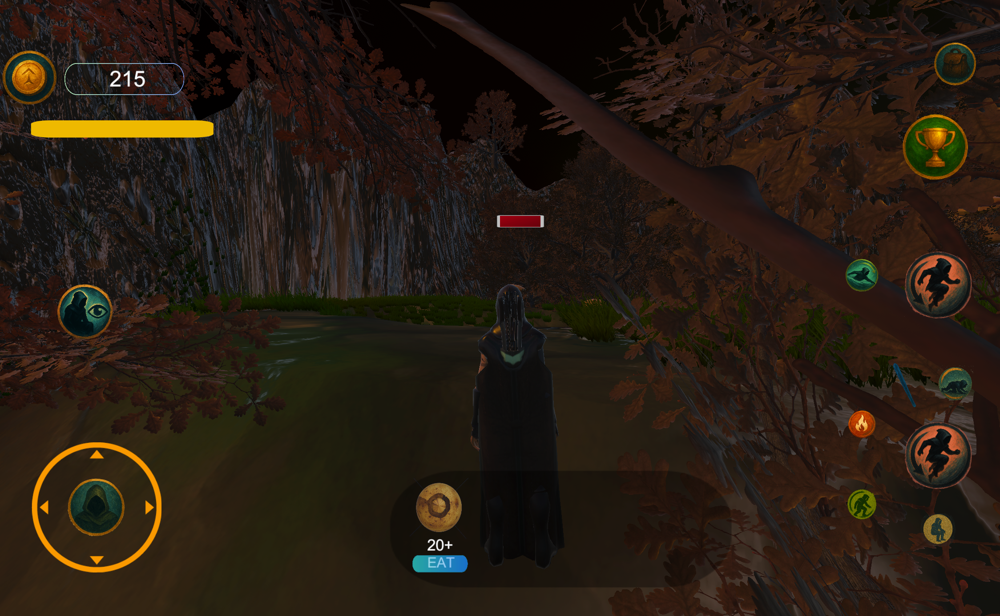
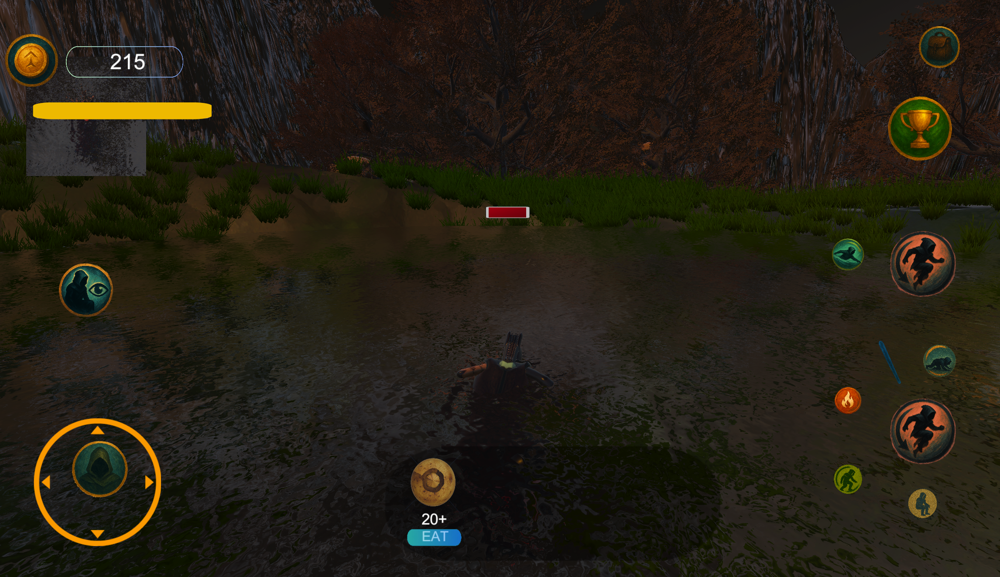

# Civilization-of-Makudians  
3D Third Person Adventure Mobile Game 
A Physics-Based Third-Person Simulation Environment Using Unity
❤️🤗🔸  

---

## 🔥 Game Trailer 🔥  

---

## 🚀 New Update Coming Soon  

A **major update is currently in development** introducing advanced **physics-based gameplay systems** and new features:

- 🌊 Improved **water physics & swimming mechanics**  
- ⚙️ Enhanced **real-time character physics interactions**  
- 🎮 New **multiplayer system**  
- 🧍 More realistic **movement and animation transitions**  
- 🧠 Better **environment interaction and survival mechanics**  

This update focuses on integrating **real-world physics concepts** into gameplay to create a more immersive experience.

---

## 🖼️ Game Preview  

### 🌍 Environment  

### 🌊 Water & Physics Interaction  

---

## 🎥 More Gameplay Videos  

Watch more project updates here 👇  
https://youtube.com/@civilizationofmakudians1726?si=ZH0pganJQpfX3-sZ  

---

## 🎯 About the Project  

*Civilization of Makudians* is a **physics-based third-person game** developed using Unity.  
The project explores how **game development can be used to simulate real-world physics systems** in an interactive environment.

---

## ⭐ Status  

✅ Initial version published (Single Player)  
🚧 Next version in development (Multiplayer + Advanced Physics)  

---

## 👨‍💻 Developer  

Chamuditha Dissanayake  
Physics Graduate | Game Developer | Computational Physics  

---
